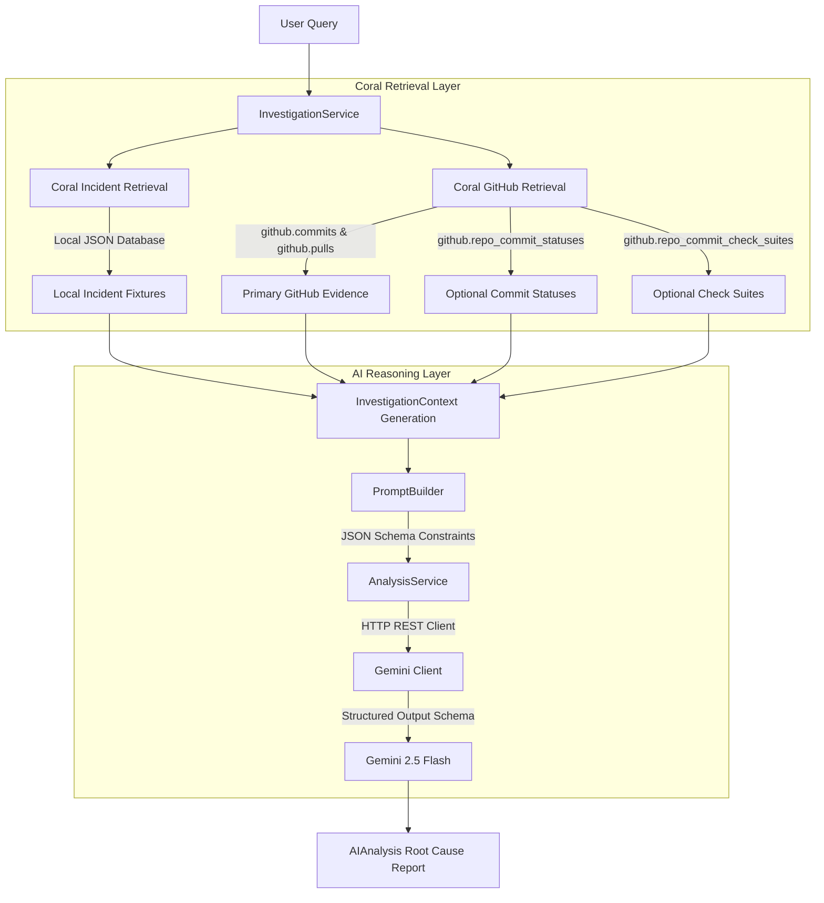

# Sond: Production Intelligence System

Sond is an AI-powered production intelligence system designed to help developers investigate production failures by correlating repository activity, operational logs, and status checks into a single cohesive workflow using Coral as the structured retrieval layer.

Instead of manually jumping between git histories, check suite logs, and release trackers while debugging deployments, Sond surfaces the most relevant operational evidence and identifies possible root causes with Google Gemini-powered analysis.

---

## Architecture Overview

Sond follows a strict retrieval-then-analysis pipeline where the AI module consumes a pre-compiled state context with zero direct network hooks, ensuring robust type safety and isolated boundaries.

```
User Query
    ↓
InvestigationService
    ↓
Coral Retrieval Layer
    ↓
GitHub Evidence (Commits, Pull Requests, Statuses, Check Suites)
    ↓
InvestigationContext
    ↓
Gemini AI Analysis
    ↓
Root Cause Report
```

### Architecture Diagram (Flow)



---

## File Structure

Below is the project's actual component structure:

```text
sond/
├── src/
│   ├── lib/
│   │   ├── ai/                      # AI Reasoning Module
│   │   │   ├── ai-types.ts          # Strongly typed AI Analysis interfaces
│   │   │   ├── gemini-client.ts     # Lightweight Google Gemini REST Client
│   │   │   ├── prompt-builder.ts    # Renders context records into markdown prompt
│   │   │   └── analysis-service.ts  # Orchestrates builder, client, and JSON schema
│   │   │
│   │   ├── coral/                   # Coral Database Retrieval Layer
│   │   │   ├── coral-client.ts      # Subprocess-based Coral query client
│   │   │   ├── coral-github.ts      # Virtual tables database queries with timing
│   │   │   ├── coral-types.ts       # Row and evidence data schemas
│   │   │   └── incident-retrieval.ts# Local incident logs query module
│   │   │
│   │   ├── github/                  # Legacy/fallback GitHub API integrations
│   │   ├── parsers/                 # Operational log and doc parsers
│   │   └── utils.ts
│   │
│   ├── services/
│   │   └── investigation-service.ts # Core orchestration workflow service
│   │
│   ├── types/
│   │   └── investigation.ts         # Shared InvestigationContext type declarations
│   │
│   ├── app/                         # Next.js App router
│   ├── components/                  # UI components (dashboard, timeline, etc.)
│   ├── constants/
│   └── data/                        # Local database datasets & documentation
│       └── docs/
│           ├── architecture.md
│           └── workflow.md
│
├── test-gemini.ts                   # Standalone Gemini REST connectivity test
├── test-investigation.ts            # Manual Coral retrieval pipeline test
├── test-ai.ts                       # Dynamic end-to-end AI reasoning smoke test
├── .env.local                       # Environment variables config
├── package.json
└── tsconfig.json
```

---

## How Sond Works

1. **Coral Retrieval**: 
   When an investigation starts, Sond utilizes the **Coral Query Client** to communicate with SQL virtual tables. It fetches operational incident files (`src/data/logs/incident.json`), pull requests, and commit logs.
   
2. **GitHub Evidence Collection**: 
   Sond uses optimized, non-blocking queries to gather primary commits and pull requests. In parallel, it fetches commit statuses and check suites for those SHAs. If the optional statuses/checks query fails or rate-limits, it logs a warning and proceeds gracefully to ensure the pipeline never hangs.
   
3. **InvestigationContext Generation**: 
   All gathered elements are unified, mapped to strong TypeScript structures, and checked for temporal or commit-reference correlations in the `InvestigationService` to form a complete, structured state report.
   
4. **Gemini Analysis**: 
   The `AnalysisService` formats this context into a markdown prompt using the `PromptBuilder` and queries the `GeminiClient` utilizing strict `responseSchema` parameters to guarantee a structured JSON payload response.
   
5. **Structured Investigation Report**: 
   The response is parsed and populated into a robust structured analysis report featuring:
   * A concise summary of findings
   * An identified probable root cause
   * Detailed evidence checkpoints
   * Actionable remediation recommendations
   * An overall diagnostics confidence score (from `0.0` to `1.0`)

---

## Current Features

* **Coral Virtual SQL Integration**: Direct querying of incident and GitHub metadata using SQL queries over virtual APIs.
* **Highly Optimized Retrieval**: Designed with timing diagnostics and zero expensive remote-sorting operations, ensuring large repositories like `facebook/react` fetch under **5 seconds**.
* **Resilient Non-Blocking Flow**: Optional check suites and status retrievals are fully error-shielded, ensuring robust operation even in keyrate/credential rate limits.
* **Dynamic Incident Correlation**: Built-in temporal and commit-SHA correlation heuristics.
* **AI-Powered Diagnostics**: Schema-enforced root cause analysis powered by Google's Gemini 2.5 Flash.
* **Actionable Remediation Recommendations**: Automatically outputs lists of steps to roll back, deploy, or check logs.
* **Confidence Scoring**: Dynamic confidence calculation based on evidence density.

---

## Running & Testing

To configure and run the Sond diagnostics engine, follow the testing suite instructions:

### Environment Configuration
Ensure your API credentials are set inside `.env.local`:
```bash
GEMINI_API_KEY="your-google-gemini-api-key"
GITHUB_TOKEN="your-github-personal-access-token"
```

### 1. Test Gemini REST Connectivity
Verifies that your Google Gemini API key works and has available quota:
```bash
npx tsx test-gemini.ts
```

### 2. Test Coral SQL Retrieval
Traces the retrieval of commits, pull requests, check suites, and statuses through Coral:
```bash
npx tsx test-investigation.ts
```

### 3. Dynamic End-to-End AI Smoke Test
Performs the full pipeline: dynamically crawls commits, generates a matching incident, executes the full correlation, queries Gemini, parses the schema, and pretty-prints the structured report.
```bash
npx tsx test-ai.ts
```

---

## Project Roadmap

### Current Focus
* Robust repository inspection and evidence aggregation.
* Fast, structured AI root cause analysis and diagnosis.
* Fail-safe retrieval pathways and error-handling.

### Future Work
* **Interactive UI Dashboard**: Responsive web app view showing interactive timelines of logs and correlated commits.
* **Additional Operational Sources**: Integrate Slack messages, Jira tickets, and deployment logs into the Coral SQL engine.
* **Advanced Investigation Workflows**: Dynamic follow-up queries allowing developers to deep-dive into recommendations directly from the UI.